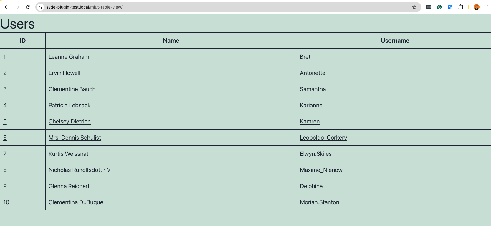

# My Lovely Users Table Plugin

## Plugin Description
The plugin is designed to enhance the WordPress frontend by displaying an HTML table of users fetched from a third-party API. This table is not populated with standard WordPress users but rather with data provided externally, ensuring that no user data is stored within the WordPress database. Each user is presented in a separate row with distinct characteristics such as ID, name, username, etc., detailed in individual columns.

A distinctive feature of this plugin is the ability to create a custom endpoint—an URL that WordPress does not recognize as standard. This means you can configure a unique endpoint like `https://example.com/mlut-table-view/` where the plugin will render the HTML table. Upon visiting this custom URL, the plugin will display the table, and each row will include links that, when clicked, reveal additional details about each user.

## Features

### Custom Endpoint
- **Option to change the endpoint**: Allows for customization of the REST endpoint to which the plugin interfaces.

### Action Hooks
- **Frontend Rendering Action Hooks**:
  - `my_lovely_users_before_table_render`
  - `my_lovely_users_after_table_render`

#### Example Usage

**Before Table Render Hook:**
```php
function my_custom_before_table_message() {
    echo '<div class="custom-message-above-table">';
    echo '<p>⭐ Welcome to our user directory! Here you can find information about all our members. ⭐</p>';
    echo '</div>';
}
add_action('my_lovely_users_before_table_render', 'my_custom_before_table_message');
```
This example shows how to add a custom message above the users table. It could be useful for displaying instructions, announcements, or any other information relevant to the context in which the table is displayed.

**After Table Render Hook:**
```php
function my_custom_after_table_script() {
    ?>
    <script>
        jQuery(document).ready(function($) {
            // Example: Highlight the table rows on hover
            $('#users-table tr').hover(function() {
                $(this).css('background-color', '#f0f0f0');
            }, function() {
                $(this).css('background-color', '');
            });
        });
    </script>
    <?php
}
add_action('my_lovely_users_after_table_render', 'my_custom_after_table_script');
```
This example illustrates how to enqueue a custom script right after the users table. This could be particularly useful for adding interactive features like tooltips, modals, or any JavaScript-driven functionality that interacts with the table or its data.

### Filter Hooks
- **Add another column to the table**:
  - `my_lovely_users_table_modify_columns`
#### Example Usage
```php
function add_custom_column_to_users_table($columns) {
    // Add new column
    $columns['email'] = 'Email';
    return $columns;
}
add_filter('my_lovely_users_table_modify_columns', 'add_custom_column_to_users_table');

```
**Screenshot: **

- **Add filter where developers can add more items to the reserved routes for the custom endpoint**:
  - `my_lovely_users_table_reserved_routes`
#### Example Usage
```php
function add_custom_route_to_reserved_routes($routes) {
    $routes[] = 'my-custom-post-type-slug’; // Adding a custom route
    return $routes;
}
add_filter('my_lovely_users_table_reserved_routes', 'add_custom_route_to_reserved_routes');
```

### Custom Endpoint Validation
- **An error will be displayed if the custom endpoint matches any of the reserved routes from WP REST API endpoints.**

**Screenshot: **

### Override default template
- **Theme developers  can override the default template by adding a file named** `template.php` **within**  `my-lovely-users-table` directory **in their theme**

## Installation (Git and Composer)
**Prerequisites:**
- Ensure you have git installed on your system. You can download it from [Git's](https://git-scm.com/downloads) official site.
- Make sure composer is installed. If it's not already installed, you can get it from [Composer's official site](https://getcomposer.org/download/).
- WordPress should be installed on your server or local development environment.
  
**Step 1: Clone the Plugin from GitHub**

Open your command line interface (CLI) and navigate to your WordPress installation directory. Specifically, go to the wp-content/plugins directory, which is where WordPress plugins are typically stored.

Clone the repository using the following command:
```bash
git clone https://github.com/coricsdev/my-lovely-users-table.git
```
This command downloads the plugin files into a directory named my-lovely-users-table inside your plugins directory.

**Step 2: Install Dependencies with Composer**

Change to the plugin's directory:

```bash
cd my-lovely-users-table
```

Run Composer to install the required PHP dependencies. 
```bash
composer install
```

This command reads the composer.json file in the plugin's directory and installs the necessary libraries and dependencies into the vendor directory within the plugin.

## Installation (Manual Method)

**Step 1:** Download the ZIP file of the repository.

**Step 2:** Go to your WordPress > Plugins > Add New

**Step 3:** Install and Activate `My Lovely Users Table` plugin

## Usage

- After activation, visit the plugin settings page to configure necessary option, such as setting up the custom endpoint.

Screenshot:


- Ensure your WordPress site's permalink structure is updated for the custom endpoint to work correctly. This can be done by going to Settings -> Permalinks in the WordPress dashboard and simply clicking "Save Changes".

- Go to the custom endpoint you set in the plugin settings. For example: `https:\\yourwebsite.com\mlut-table-view`

Screenshot:



## Packages Used:

- **inpsyde/php-coding-standards**

This package provides a set of PHP CodeSniffer rules that adhere to the coding standards defined by Inpsyde, a respected WordPress agency. It ensures that our code follows best practices and maintains consistency.

- **phpcompatibility/php-compatibility**

This tool checks for PHP version compatibility issues in our codebase. It's crucial for ensuring that our plugin works on various PHP versions that WordPress supports, especially since WordPress sites can run on a wide range of PHP environments.

- **brain/monkey**

Specifically designed for WordPress, Brain Monkey allows us to mock WordPress-specific functions and actions/filters, making it invaluable for unit testing WordPress plugins where hooks and filters play a significant role.

## Additional Notes


### Unit Testing

Adjust the `$basePluginPath` in the `TableTest.php` and `HandlerTest.php` files based on the base path of your plugin directory.
